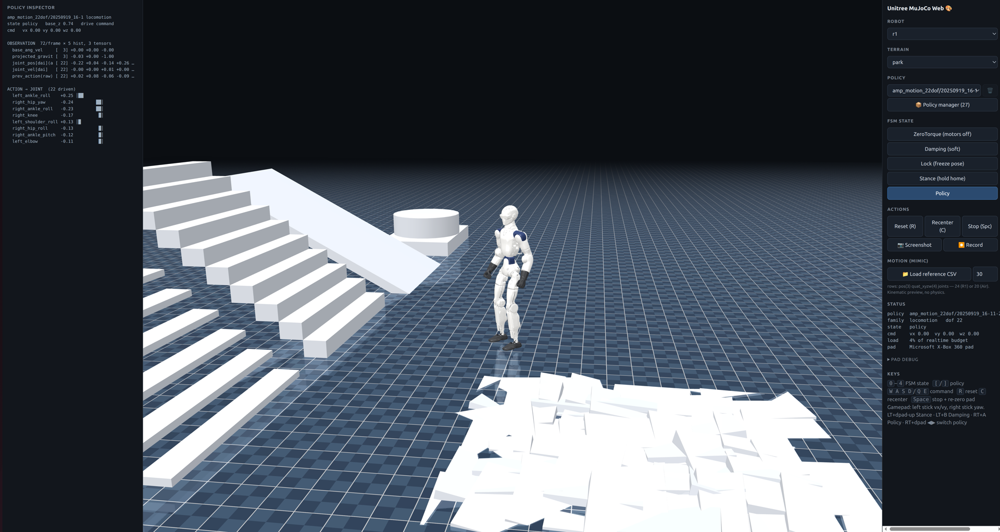
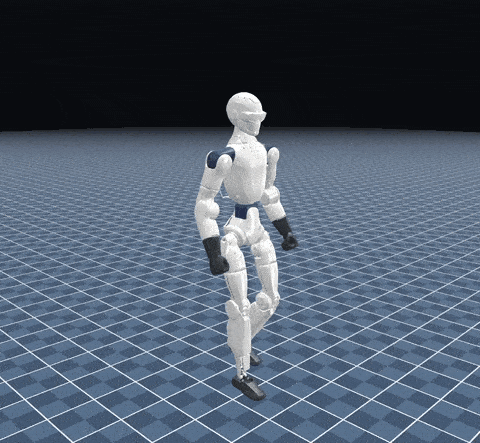
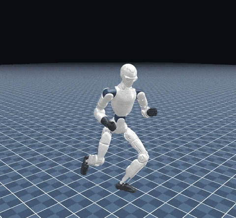
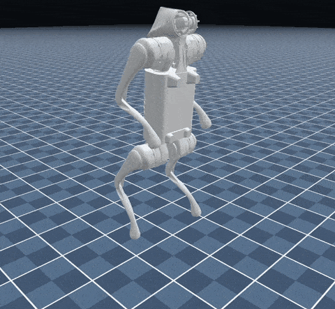
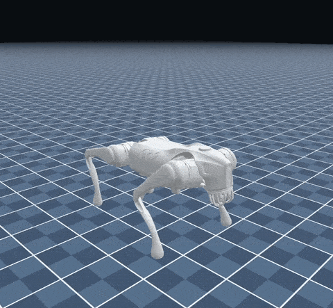

# unitree-mujoco-web

Run Unitree RL control policies **entirely in the browser** — MuJoCo compiled
to WebAssembly for physics, onnxruntime-web for policy inference, Three.js for
rendering. An on-robot-style safety FSM (ZeroTorque / Damping / Lock / Stance /
Policy), live policy switching, and gamepad teleop.



| R1 · straight-knee walk | R1 · kung fu |
|---|---|
|  |  |

| Go2 · hind-leg stand | Go2 · jump |
|---|---|
|  |  |

**Two robot families today — R1 (covers R1 and R1 Air, which share one model)
and Go2; G1 support is planned.** All six R1 on-robot policy families are
supported (motion tracking, concat & split locomotion, AMP split, armsdk,
mimic), plus Go2 locomotion (concat & split-gait), recovery and flip
maneuvers. The selected policy decides the exact spec — picking a 20-DOF Air
policy under the R1 family just works.

**The repo ships no robot-derived files** — no models, no policy weights, no
motion clips. You bring a model bundle for your robot, and import policies
*in the app* as zip **policy packs**. This project is a neutral evaluator, not
a policy distributor.

## Quick start

```bash
npm install                 # also copies the mujoco wasm runtime into public/
# put your robot's model bundle under public/assets/models/<robot>/ (see below)
npm run dev                 # open the printed URL (Chrome recommended)
```

Then, in the app: **📦 Policy manager → Import pack / bundle (.zip)** and pick
your pack files (or one per-model bundle). Imported policies persist locally in
your browser (IndexedDB) and survive reloads — as do your robot, terrain and
policy selections.

**📥 Policy packs download:** <https://disk.yandex.com/d/TDS0JYh1GSjXow> —
grab `r1-all.zip` / `go2-all.zip` (or individual packs) and import them via the
Policy manager.

## Robot models

The engine expects one bundle per robot model under
`public/assets/models/<name>/`:

```
scene.xml            entry MJCF (may <include> others)
…                    everything scene.xml references (xml, meshes, textures)
manifest.json        {"files": ["scene.xml", "assets/trunk.obj", …]}
```

`manifest.json` lists every file of the bundle; the app copies them into the
wasm filesystem before compiling. `public/assets/` is gitignored — extract the
bundle from your own robot.

## Policy packs

A **pack** is a self-contained `.zip`: `config.yaml` (obs scheme, gains,
family) + one or more `.onnx` checkpoints sharing that scheme + an optional
`traj.csv` reference clip. A **bundle** is a `.zip` of packs — one file per
robot model, convenient for file-host distribution. The importer auto-detects
which one you gave it. Format spec: [policy-packs/README.md](policy-packs/README.md).

## What it does

1. **Physics in-page** — the official MuJoCo WASM bindings compile the same
   MJCF + mesh bundle used on the desktop; PD control at 500 Hz, policy at
   50 Hz.
2. **Policy player** — switching policies hot-swaps the driver without
   reloading the page; the picker groups every policy by obs scheme.
3. **FSM** — ZeroTorque / Damping / Lock / Stance / Policy, same semantics as
   the on-robot controller's safety states.
4. **Gamepad** — left stick → vx/vy, right stick → yaw for velocity-command
   policies, plus on-robot-style combos (LT+dpad-up → Stance, LT+B → Damping,
   RT+A → Policy, RT+dpad ◀▶ → prev/next policy).
5. **Terrain presets** — flat / rough / slope / stairs / park (an obstacle
   playground with slopes, stairs and rough patches).
6. **MuJoCo-style scene** — checker groundplane with a real mirror pass; the
   robot renders as two-tone plastic (clearcoat + studio environment).
7. **Robot painter** — `/painter.html` (🎨 in the panel): click a part to
   color / hide / switch glossy-matte. Overrides persist and restyle the
   running sim live, across tabs.
8. **Reference-motion playback** — *Motion (mimic)* → load a retargeted mocap
   CSV (`pos(3), quat_xyzw(4), joint_pos` per row) and preview it
   kinematically — no physics, no policy — before training a tracker.
9. **Policy manager** — slide-out column: import packs/bundles, see the active
   family's imports, remove any pack with its 🗑.
10. **Policy inspector** — the left column streams the active policy's live
    observations (every obs term, dims, sample values, frame topology) and the
    action → joint targets with diverging bars.
11. **Capture** — 📷 screenshot and ⏺ canvas recording (webm) straight from
    the panel.
12. **Session restore** — robot, terrain and policy selections persist across
    reloads (localStorage).

## Controls

| Input | Action |
|---|---|
| `0`–`4` | FSM state (ZeroTorque, Damping, Lock, Stance, Policy) |
| `[` / `]` | previous / next policy |
| `W A S D` / `Q E` | nudge vx / yaw / vy command |
| `R` / `C` / `Space` | reset pose / recenter / stop + re-zero pad neutral |
| left stick, right stick | vx+vy, yaw (locomotion policies) |
| LT+dpad-up, LT+B, LT+Y, LT+X | Stance, Damping, ZeroTorque, Lock |
| RT+A, RT+B, RT+dpad ◀▶ | Policy, reset, switch policy |

## Architecture

The **entire simulation runs in a Web Worker** — MuJoCo wasm, onnxruntime,
drivers, FSM. This is required, not optional: MuJoCo's wasm build is
pthread-enabled and blocking on the browser main thread deadlocks it. The main
thread only renders (Three.js), draws the panel, and reads the keyboard /
gamepad; the two sides exchange messages (`src/sim/protocol.ts`): model
description + geom transforms out, commands in. Model compilation additionally
forces `<compiler usethread="false"/>` — threaded MJCF compile blocks on
pthread workers that can't boot while the caller is blocked.

```
src/
  worker/      sim.worker.ts — owns the engine, FSM, drivers, control loop
  core/        math, obs builders, onnx wrappers, drivers (per policy family)
  packs/       policy-pack parsing, IndexedDB store, blob-URL resolution
  sim/         engine (mujoco wasm + MEMFS), FSM, terrain presets, protocol
  render/      Three.js scene built from the worker's model description
  input/       Gamepad API → command + combos
  robots/      per-robot specs (joint order, anchor body, model bundle)
  ui/          control panel + policy manager (plain DOM)
policy-packs/  pack format docs; built packs/bundles are gitignored
```

## Notes

- Hosting a production build needs **COOP/COEP headers** (the mujoco wasm uses
  SharedArrayBuffer): `Cross-Origin-Opener-Policy: same-origin` and
  `Cross-Origin-Embedder-Policy: require-corp`. Dev and preview servers set
  them already.
- onnxruntime-web runs single-threaded (`numThreads=1`) via its self-contained
  bundle build — don't set `ort.env.wasm.wasmPaths`, it breaks under vite.
- Browser support: Chrome/Edge/Firefox current; Safari 16.4+ (nested workers —
  untested).
